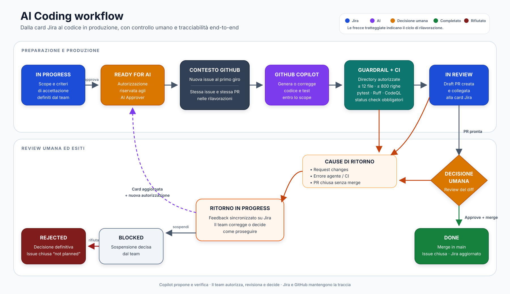

# AI Coding Runbook — SCOPE

Guida operativa per affidare attività di sviluppo a GitHub Copilot partendo da Jira,
mantenendo revisione, approvazione e decisione finale sotto responsabilità umana.

- **Owner:** team Quality Assurance
- **Repository:** `pagopa/qe_scope`
- **Fase:** pilota controllato
- **Ultima verifica end-to-end:** 5 settembre 2026

## Scopo

Il processo trasforma una `AI Coding Story` Jira in una GitHub Issue, incarica Copilot di
produrre una modifica, crea una Draft Pull Request e sincronizza su Jira gli esiti principali.

L'automazione produce codice e feedback tecnici; non sostituisce la responsabilità del team.
Una persona decide sempre se richiedere modifiche, approvare, unire o rifiutare il lavoro.

## Flusso in sintesi



[Apri il diagramma SVG modificabile](AI_CODING_WORKFLOW.svg)

## Ruoli e responsabilità

| Ruolo | Responsabilità |
|---|---|
| Richiedente | Spiega il risultato atteso e il valore dell'attività. |
| Responsabile umano | Rifinisce la card, controlla lo scope, segue gli errori e coordina la review. |
| AI Approver | È autorizzato a spostare la card in `Ready for AI`. Verifica prima la checklist. |
| GitHub Copilot | Propone una modifica entro i vincoli tecnici e genera feedback verificabile. |
| Reviewer | Legge il diff, valuta comportamento e rischi, richiede correzioni o approva. |
| Maintainer | Esegue il merge nel rispetto delle protezioni di `main`. |

Il bypass delle protezioni, se assegnato, è una capacità di emergenza: non sostituisce la
review umana ordinaria.

## Quando usare una AI Coding Story

Usarla per attività circoscritte, verificabili e compatibili con il perimetro tecnico
dell'agente. Esempi adatti:

- una correzione locale con comportamento atteso esplicito;
- un test di regressione ben definito;
- una piccola modifica applicativa con criteri di accettazione osservabili;
- un refactoring limitato che non modifica contratti o dipendenze.

Non usarla direttamente per:

- richieste ambigue o con più obiettivi indipendenti;
- cambiamenti architetturali, migrazioni o refactoring estesi;
- autenticazione, segreti o configurazione di produzione;
- nuove dipendenze non preventivamente autorizzate;
- modifiche a workflow, script, documentazione o altri file fuori dal perimetro consentito;
- attività che richiedono dati riservati o accessi non disponibili al runner.

Per SCOPE l'agente può creare o modificare esclusivamente file sotto `src/scope/` e `tests/`.
Il workflow rifiuta modifiche fuori da queste directory, file binari, symlink, più di 12 file
o più di 800 righe complessivamente modificate.

## Struttura consigliata della card

```text
Obiettivo
<Un solo risultato da ottenere e il motivo per cui serve>

Comportamento attuale
<Cosa accade oggi, con un esempio riproducibile>

Comportamento atteso
<Cosa deve accadere dopo la modifica>

Criteri di accettazione
- <Esito osservabile 1>
- <Esito osservabile 2>
- <Caso limite rilevante>

Fuori scope
- <Aspetti che l'agente non deve modificare>

Vincoli tecnici
- File o moduli interessati, se noti
- Nessuna nuova dipendenza
- Test richiesti
```

Evitare di prescrivere una soluzione tecnica se non è un requisito. Fornire invece esempi,
vincoli e risultati verificabili che consentano all'agente e al reviewer di valutare il lavoro.

## Checklist prima di Ready for AI

L'AI Approver verifica che:

- [ ] il work type sia `AI Coding Story`;
- [ ] esista un solo risultato principale;
- [ ] descrizione e criteri di accettazione siano completi e non contraddittori;
- [ ] siano indicati i casi limite rilevanti;
- [ ] la modifica rientri in `src/scope/` e/o `tests/`;
- [ ] non siano richieste nuove dipendenze o modifiche alla produzione;
- [ ] non siano presenti credenziali, dati personali o informazioni riservate;
- [ ] il responsabile umano sia assegnato;
- [ ] per una nuova attività, `GitHub Issue URL` e `GitHub PR URL` siano vuoti;
- [ ] per una rilavorazione, issue e PR siano ancora valide e la PR sia aperta;
- [ ] la card si trovi in `In Progress`.

Solo dopo questi controlli la card passa a `Ready for AI`.

## Prima implementazione

1. Il passaggio `In Progress → Ready for AI` autorizza l'elaborazione.
2. Jira crea una GitHub Issue con label `ready-for-ai` e salva il relativo URL nella card.
3. `Copilot implement issue` legge issue e istruzioni del repository.
4. Copilot genera una modifica in un ambiente senza credenziali Git di scrittura.
5. Il workflow valida perimetro e dimensione, quindi esegue:

   ```bash
   pytest
   ruff check src/ tests/
   ```

6. Un job separato pubblica il commit su un branch `copilot/issue-*` e crea una Draft PR.
7. Jira salva `GitHub PR URL` e porta la card in `In Review`.

La card resta in `Ready for AI` mentre l'agente lavora. L'assenza di un cambio immediato di
stato non indica da sola un malfunzionamento.

## Telemetria della prima implementazione

Durante `Copilot implement issue`, Copilot CLI esporta una telemetria OpenTelemetry locale senza
includere il contenuto di prompt e risposte. Il workflow genera due file:

- `copilot-technical-report.json`: riepilogo strutturato della singola esecuzione;
- `copilot-otel.jsonl`: telemetria grezza da usare solo per verifica e diagnosi.

I file sono pubblicati nell'artifact GitHub Actions
`copilot-technical-report-<run-id>-<attempt>` e conservati per 7 giorni. Il JSON sintetico è la
fonte strutturata; il commento Jira ne mostra soltanto un estratto leggibile e non deve essere
usato come database delle metriche.

Quando la Draft PR viene creata, Jira registra:

- link alla PR e al GitHub Actions run;
- modello effettivamente osservato, oppure modello richiesto come fallback;
- input e output token;
- input token letti dalla cache;
- numero di turni verso il modello;
- AI units, quando esposte in una forma riconosciuta.

### Come leggere il commento Jira

| Dato | Significato | Cosa non significa |
|---|---|---|
| Modello | Modello effettivamente riportato dalle chiamate LLM; se non disponibile, modello richiesto. | Non garantisce da solo qualità o correttezza della modifica. |
| Input token | Somma degli input elaborati in tutti i turni della sessione. Il contesto può essere reinviato più volte. | Non è la sola lunghezza della descrizione Jira o del prompt iniziale. |
| Output token | Somma degli output prodotti dal modello nei diversi turni. | Non corrisponde alle righe di codice aggiunte. |
| Cache read | Parte degli input token recuperata dalla cache del provider. | Non va sommata nuovamente agli input token e non equivale automaticamente a un risparmio monetario. |
| Turni | Numero di round-trip tra agente e modello durante l'implementazione. | Non è il numero di interventi umani o di esecuzioni del workflow. |
| AI units | Unità di consumo Copilot, se disponibili. | Non sono token e non sono necessariamente un costo in euro. |
| Dettagli tecnici | Run GitHub Actions da cui provengono report e artifact. | Non sostituisce la review della PR. |

I token sono cumulativi: un agente che legge file, modifica codice, controlla il risultato e
corregge un errore invia al modello un contesto aggiornato a ogni turno. Per questo il numero di
input token può essere molto maggiore della card Jira. Un valore alto non indica da solo spreco;
va confrontato con attività simili, stesso modello, stessa versione della CLI ed esito ottenuto.

`non disponibile` significa che il dato non è stato esposto oppure che il parser non ne ha
riconosciuto la forma. Non significa `0` e non deve entrare nei calcoli come zero.

### Esempio reale validato

La prima verifica, eseguita il 5 settembre 2026 su `QA-17085`, ha prodotto:

```text
Modello: claude-sonnet-5
Input token: 145053
Output token: 2749
Cache read: 128714 token
Turni: 11
AI units: non disponibile
```

La telemetria grezza contiene un solo span principale `invoke_agent`: i valori non risultano
quindi duplicati. I `128714` token letti dalla cache sono già compresi nel volume di input e non
vanno aggiunti ai `145053`. Il report ha misurato circa 31 secondi per l'invocazione Copilot,
mentre il workflow completo, inclusi controlli e pubblicazione, è durato circa 1 minuto e 50
secondi.

La versione Copilot CLI osservata era `1.0.83`. In quella prima esecuzione l'output reale aveva
esposto le AI units tramite `github.copilot.nano_aiu`, che il parser iniziale non convertiva;
per questo il commento storico Jira le mostra come non disponibili. Il parser successivo
riconosce sia `github.copilot.aiu` sia `github.copilot.nano_aiu`, convertendo quest'ultimo da
nano-unità, e identifica lo span principale tramite l'assenza di `parentSpanId`. Riconosce inoltre
`gen_ai.usage.cache_write.input_tokens` come volume scritto nella cache. I report successivi alla
correzione possono quindi valorizzare questi dati senza modificare il risultato storico.

### Uso corretto nel pilota

Usare questi dati per:

- individuare esecuzioni anomale o attività troppo ampie;
- confrontare tentativi e rework della stessa classe di attività;
- verificare l'effetto di un cambio di modello o istruzioni;
- correlare consumo, durata ed esito della review.

Non usare token, turni o righe modificate come misura isolata della produttività dello
sviluppatore o della qualità del modello. L'esito rilevante resta una modifica corretta,
comprensibile, verificata e accettata attraverso review umana.

### Dataset tecnico aggregato

Il workflow GitHub Actions `Collect AI technical metrics` consolida i report ancora disponibili
con lo stato dei relativi run e delle Pull Request. La prima versione è avviata manualmente da
`Actions → Collect AI technical metrics → Run workflow` e non interroga Jira.

Il risultato persistente è `ai-metrics/executions.json` nel branch tecnico
`ai-metrics-data`. Ogni record è identificato da `<run-id>:<run-attempt>`: rilanciare il collector
non duplica l'esecuzione e aggiorna gli attributi mutabili della PR, per esempio il passaggio da
aperta a merged. Il dataset conserva i dati già acquisiti anche dopo la scadenza degli artifact
GitHub Actions ed è la fonte destinata alla futura dashboard HTML.

Il workflow pubblica inoltre una copia del dataset come artifact
`ai-technical-metrics-<collector-run-id>`, conservata per 30 giorni. Il branch dati è una fonte
tecnica generata automaticamente: non va modificato a mano e non entra nel flusso di merge verso
`main`.

Lo stesso workflow genera `ai-metrics/index.html`, una dashboard autocontenuta che può essere
scaricata insieme al dataset dall'artifact e aperta localmente nel browser. La pagina presenta
una sintesi per stakeholder e il dettaglio tecnico per singola esecuzione, con filtri e link alle
evidenze GitHub. In questa fase non è ancora pubblicata tramite GitHub Pages.

Il collector viene eseguito automaticamente ogni giorno alle `23:30` nel fuso
`Europe/Rome`, seguendo quindi il passaggio tra ora solare e ora legale. GitHub può avviare i
workflow pianificati con alcuni minuti di ritardo nei momenti di maggiore carico. L'avvio manuale
resta disponibile per verifiche o aggiornamenti immediati. La schedulazione usa sempre la versione
del workflow presente sul branch predefinito `main`.

Nei repository pubblici GitHub può disabilitare i workflow pianificati dopo 60 giorni senza
attività. Il controllo periodico del pilota deve quindi includere la verifica che il workflow
`Collect AI technical metrics` sia ancora abilitato.

Gli indicatori mostrati includono successo del workflow, produzione e merge delle PR, mediane
dei tempi osservabili, token, modello e dimensione della modifica. Sono metriche del processo
tecnico: non dimostrano da sole qualità del codice, produttività individuale, difetti evitati o
tempo umano effettivamente impiegato.

## Review e merge

Il reviewer:

1. legge descrizione, diff e conversazioni della PR;
2. verifica che lo scope corrisponda alla card Jira;
3. controlla che `SCOPE CI / required`, test, Ruff e CodeQL siano verdi;
4. usa `Update branch` se GitHub segnala che il branch è indietro rispetto a `main`;
5. porta la PR da Draft a `Ready for review` solo quando è esaminabile;
6. sceglie `Approve` oppure `Request changes` con indicazioni concrete.

Dopo il merge in `main`, GitHub chiude la issue collegata e invia `pr_merged`; Jira aggiunge
il commento di audit e porta la card in `Done`.

## Definition of Done

Una AI Coding Story è completata soltanto quando:

- [ ] i criteri di accettazione sono soddisfatti;
- [ ] la modifica resta entro lo scope autorizzato;
- [ ] test, Ruff, CodeQL e status check richiesti sono verdi;
- [ ] non rimangono conversazioni di review irrisolte;
- [ ] una persona ha valutato il diff e i rischi;
- [ ] la PR è stata integrata in `main`;
- [ ] la GitHub Issue è chiusa;
- [ ] Jira ha registrato il merge ed è passato automaticamente a `Done`.

## Rilavorazione dopo Request changes

1. Una review `Request changes` invia `pr_changes_requested` a Jira.
2. Jira registra reviewer, commento e URL della review, poi riporta la card in `In Progress`.
3. Il responsabile umano aggiorna la card con le correzioni richieste.
4. L'AI Approver ricontrolla la card e la riporta in `Ready for AI`.
5. `Copilot rework pull request` legge la card aggiornata e i commenti GitHub.
6. Copilot aggiunge un commit alla stessa PR; non ne crea una nuova.
7. Dopo validazione e pubblicazione, `pr_updated` riporta Jira in `In Review`.

Il ciclo può ripetersi. Ogni iterazione deve avere feedback specifico; non usare commenti come
"non va" o "riprova" senza indicare il comportamento da correggere.

## PR chiusa senza merge

La chiusura di una PR Copilot senza merge invia `pr_closed_without_merge`. Jira registra
l'evento e riporta la card da `In Review` a `In Progress`; la GitHub Issue resta aperta.

Se il lavoro deve continuare:

1. riaprire la stessa PR;
2. non eliminare il branch `copilot/issue-*`;
3. aggiornare la card;
4. riportarla in `Ready for AI`.

Il workflow di rilavorazione rifiuta intenzionalmente una PR ancora chiusa.

## Fallimenti dell'agente o dei workflow

Gli eventi gestiti sono:

| Evento | Significato | Esito Jira |
|---|---|---|
| `ai_implementation_failed` | Fallita generazione o pubblicazione iniziale | `In Progress` |
| `ai_rework_failed` | Fallita una rilavorazione della PR | `In Progress` |
| `pr_changes_requested` | Reviewer richiede correzioni | `In Progress` |
| `pr_closed_without_merge` | PR chiusa senza integrazione | `In Progress` |
| `pr_created` | Draft PR iniziale creata | `In Review` |
| `pr_updated` | PR esistente aggiornata | `In Review` |
| `pr_merged` | PR integrata in `main` | `Done` |

Procedura di triage:

1. aprire il link GitHub Actions aggiunto nel commento Jira;
2. identificare la prima fase fallita, senza fermarsi al nome generale del workflow;
3. classificare la causa: richiesta incompatibile, nessuna modifica, limiti di perimetro,
   test/lint, stato della PR, autenticazione/API oppure indisponibilità del servizio;
4. correggere la card o il problema tecnico;
5. rilanciare solo dopo avere rimosso la causa.

Se la prima implementazione fallisce dopo che la issue è stata creata ma prima della PR:

1. correggere sia la card Jira sia la GitHub Issue esistente;
2. riportare la card in `Ready for AI`;
3. avviare manualmente `Copilot implement issue` da GitHub Actions con il numero della issue.

Non eliminare `GitHub Issue URL` per provocare la creazione di una issue duplicata.

## Blocco e rifiuto definitivo

`Blocked` e `Rejected` hanno significati distinti:

- `In Progress → Blocked`: lavorazione sospesa in attesa di una decisione; issue aperta;
- `Blocked → Rejected`: decisione umana definitiva; attività da non realizzare.

Prima del rifiuto, l'eventuale PR deve essere già chiusa senza merge. Il passaggio a `Rejected`
avvia `Reject AI work from Jira`, che verifica i riferimenti e chiude la GitHub Issue come
`not planned`. Esecuzioni duplicate su una issue già rifiutata non producono effetti ulteriori.

## Matrice delle automazioni

| Origine | Condizione/evento | Automazione | Destinazione |
|---|---|---|---|
| Jira | Nuova card passa a `Ready for AI`, issue URL vuoto | Crea issue con `ready-for-ai` | GitHub Issue |
| GitHub | Issue aperta con `ready-for-ai` | `Copilot implement issue` | Draft PR |
| Jira | Card con issue e PR torna a `Ready for AI` | `Jira to GitHub - Rework Copilot PR` | Workflow di rilavorazione |
| GitHub | Review con changes requested | `Notify Jira when PR changes are requested` | Jira `In Progress` |
| GitHub | PR chiusa | `Notify Jira when Copilot PR is closed` | Jira `Done` o `In Progress` |
| Jira | `Blocked → Rejected` | `Jira to GitHub - Reject AI work` | Issue `not planned` |

Il flow Jira `GitHub to Jira - PR lifecycle` riceve gli eventi GitHub e applica commenti e
transizioni. I suoi rami JQL devono avere disattivata l'opzione che limita l'elaborazione ai soli
work item modificati dall'ultima esecuzione.

## Sicurezza e controllo

- Conservare token e webhook secret solo nei secret GitHub e nei campi Jira marcati `Hidden`.
- Usare token a privilegi minimi, con scadenza e rotazione pianificata.
- Non copiare segreti in card, issue, commenti, prompt o log.
- Limitare la transizione `Ready for AI` agli AI Approver autorizzati.
- Mantenere `main` protetto da PR, status check e review umana.
- Separare generazione senza credenziali di scrittura e pubblicazione validata.
- Non allargare directory, numero di file o soglia di righe per risolvere una singola card.
- Controllare periodicamente audit log Jira e storico GitHub Actions.

In caso di incidente, disabilitare prima i flow Jira in uscita per fermare nuovi incarichi,
lasciando se possibile attivo il flow in ingresso per ricevere gli esiti già in corso. Revocare
o ruotare immediatamente i token se si sospetta un'esposizione.

## Metriche del pilota

Misurare per almeno 2–4 settimane:

- numero di AI Coding Story avviate, completate, fallite e rifiutate;
- tempo da `Ready for AI` alla prima Draft PR;
- tempo umano di review e tempo totale fino a `Done`;
- percentuale approvata al primo ciclo;
- numero medio di cicli `Request changes`;
- fallimenti per categoria e tempo di recupero;
- difetti trovati in review o dopo il merge;
- consumo di GitHub Actions/Copilot per attività.

Non usare righe di codice o numero di PR come misura isolata di produttività. L'obiettivo è
ridurre il lead time mantenendo o migliorando qualità, sicurezza e comprensibilità.

## Controllo periodico

Ogni due settimane il referente del processo verifica:

- errori ricorrenti e richieste spesso fuori perimetro;
- efficacia delle istruzioni in `.github/copilot-instructions.md`;
- validità di token, secret e autorizzazioni;
- falsi positivi/negativi dei limiti di sicurezza;
- qualità delle review e degli acceptance criteria;
- opportunità di estendere il pilota o correggere il processo.

Aggiornare questo runbook insieme alle automazioni: workflow e documentazione devono descrivere
lo stesso comportamento.
